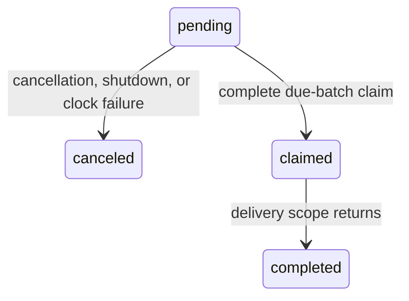

# Execution scheduling

A system receives an attachment-scoped `SchedulingLease` through
`SystemPreparationContext.scheduling`. After startup completes, it can register
a delivery handoff at an absolute logical `Duration`, or after a delay from
registration. Every attachment uses the same origin as
[execution logical time](execution-time-service.md).

```swift
let scheduling = context.scheduling

// Later, after execution startup, with a record identity from this attachment:
let handle = try scheduling.schedule(after: .milliseconds(25), for: record) {
    await adapter.deliver()
}
```

The record identity provides a declared track and stable local sequence. That
sequence may describe a dynamic operation without a persisted record at that
position. The lease validates track ownership and obtains attachment and track
order from setup. Scheduling neither claims a replay record nor changes track
usage; system behavior owns those operations.

## Time and order

Logical delays map one-to-one onto the execution's `ContinuousClock`. One
worker owns at most one active wait for the earliest deadline. Earlier
registration replaces that wait; later registration preserves it. Canceling the
earliest pending item selects the next deadline, or cancels the wait when the
queue becomes empty. Timers request zero tolerance. A wake rechecks logical time
before claiming work, so an early wake cannot cause early handoff. Host load can
delay delivery.

Every drain atomically claims the complete currently due batch, ordered by:

1. logical deadline;
2. attachment declaration order;
3. track declaration order and record sequence;
4. atomic registration sequence.

The [Core execution clock](execution-time-service.md#swift-clock-for-application-code)
also registers runtime sleeps with this engine. For equal deadlines, attachment
work precedes execution-clock sleeps, which use atomic registration order among
themselves. These sleeps have execution context rather than fabricated track or
record identities. They never claim or consume recorded values.

A late wake preserves this ordering across different deadlines. Work registered
while delivery runs joins a subsequent batch, including work with an earlier
logical deadline. Handoff order determines task submission, not delivery body
execution or actor arrival order. Independent equally due events may execute
in either order. An adapter must enforce any causal order its own stream needs.

Zero and already-passed deadlines, including offsets before the execution
origin, are queued for the next drain.
Registration never invokes a handoff inline. The worker may run concurrently
with the registering caller, so shared system state still needs its own
synchronization. The worker submits tasks serially outside scheduler and
execution locks. Delivery tasks may register additional work.

## Cancellation

Registration returns a `ScheduledItemHandle`. Copies share one registration;
discarding the handle leaves the work scheduled. `cancel()` returns `true` only
for the call that changes pending work to canceled. Repeated cancellation,
cancellation after batch claim, and cancellation after shutdown return `false`.
The engine serializes cancellation with the entire batch claim. A callback
cannot cancel another item that was claimed in its same due batch.



## Scoped delivery

An async `delivery: @Sendable () async -> Void` closure completes automatically
when it returns. There is no public acknowledgement token or completion method
to call. Registration is synchronous and immediately returns the cancellation
handle; the delivery begins later, after the engine claims it.

```swift
let handle = try scheduling.schedule(after: .milliseconds(25), for: record) {
    await adapter.deliver()
}
```

The execution owns each async delivery as a child task and joins it at finish.
A suspended delivery does not block later deadlines or handoffs. Early returns
and handled errors, including handled cancellation, finish the scope normally.
The callback is nonthrowing; adapters retain responsibility for their own error
semantics. A canceled finish waiter does not cancel claimed delivery tasks.

Await all owned work within the delivery. An adapter can await a native queue or
event-loop operation whose return establishes actual delivery completion.
Enqueuing a callback and returning immediately puts that callback outside the
scope. The scope does not include arbitrary consumer tasks launched by an
application callback. Adapters that need FIFO delivery must coordinate it
explicitly; a serial executor alone does not establish task arrival order.

## Shutdown and ownership

The worker starts with the first accepted registration. Executions that never
schedule work create no scheduler worker or timer. Finish stamps and freezes
the logical horizon while closing admission,
cancels pending registrations, releases their captures, and cancels and joins
the active wait. It joins every claimed delivery task before system cleanup and
report freezing. A claimed delivery may complete during shutdown but cannot
schedule follow-up work.
Pending clock sleeps resume with `CancellationError`; claimed sleeps complete
normally. The scheduler joins their handoff, not subsequent application work.

Repeated and concurrent `finish()` callers share one result. Canceling a finish
waiter does not cancel delivery, abandon cleanup, or return a partial result.
Late timer wakes cannot reopen scheduling. No scheduled delivery can occur
after the final result returns. New misuse of an escaped lease may still
produce a diagnostic in the reporter's post-finish log.

Cancellation, delivery, and finalization resume continuations and release
callback captures outside scheduler isolation. Terminal handles retain only
their small registration state, with no callback captures, execution, scheduler,
clock source, or reporter ownership.

The adapter must not await its execution's finish before completing a claimed
delivery: finish is waiting for that delivery. An async scope that never
completes prevents quiescence. There is no forced
termination or finalization timeout. Cancellation of pending scheduler work
does not undo a system's replay claim or return a group to availability.

## Failures

Negative relative delays, logical addition overflow, and a future deadline outside the host
timer's representable range fail before registration. Invalid tracks, calls
before startup or after closure, backward clock readings, and internal wait
failures produce safe `SchedulingFailure` or asynchronous scheduling diagnostics.
A clock failure cancels pending work; already claimed deliveries still complete
before finalization. Diagnostics participate in opt-in `noUnexpectedOperations`
evaluation; post-finish facts remain in the
reporter's separate late log. No host instant or underlying clock error enters
the report or scenario data.
